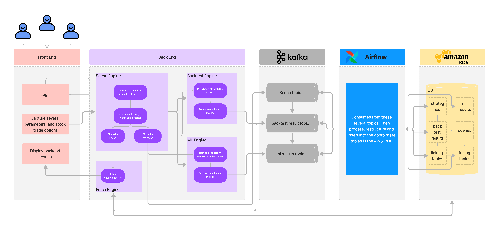

# BACK TESTING

## Cryptocurrency and stock trading engineering: A scalable back testing infrastructure and a reliable, large-scale trading data pipeline

#### Initial system architecture design


## Project details

**Table of contents**

- [Introduction](#introduction)
- [Overview](#overview)
- [Objective](#objective)
- [Data](#data)
- [Requirements](#requirements)
- [Install](#install)
- [Using the application](#examples)
- [Frontend](#frontend)
- [Backend](#backend)
- [Screenshots](#screenshots)
- [Notebooks](#notebooks)
- [Scripts](#scripts)
- [Strategies](#strategies)
- [Test](#test)
- [Authors](#authors)

## Introduction

> Data is everywhere. In order to get the best out of it one needs to extract it from several sources, make required transformations and load it to a data warehouse for further analysis and explorations. This is where ETL data pipelines come to use.

> A cryptocurrency is a digital or virtual currency that is secured by cryptography, which makes it nearly impossible to counterfeit or double-spend. Many cryptocurrencies are decentralized networks based on blockchain technology—a distributed ledger enforced by a disparate network of computers.

> A defining feature of cryptocurrencies is that they are generally not issued by any central authority, rendering them theoretically immune to government interference or manipulation.

## Overview

> Mela is your client this week. A startup called Mela wants to make it simple for everyone to enter the world of cryptocurrencies and stock market trading in general. It also wants to give investors a reliable source of investment while lowering the risk associated with trading cryptocurrencies.

## Objective

> This objective of this project is very straightforward: design and build a reliable, large-scale trading data pipeline, for both crypto and stock market trading.
>
> Users will be prompted with several different stock and crypto trading options and parameters. After processing these parameters users will then be provided with several back testing outputs using different strategies on the specific stock or crypto trading.

## Data

> The data used for generating these back testing results comes from several historical data of stocks and crypto currency trades.
> These datasets are publicly available and can be found at [yahoo finance](https://help.yahoo.com/kb/SLN2311.html) and [binance](https://www.binance.com/en/landing/data).
> You can read a brief description of what a K-line or candlestick data is [here](https://www.investopedia.com/terms/c/candlestick.asp).

> Basic features of the data sets:
>
> - Date: The day the specific trade was recorded
> - Open: The opening price of the trade at the beginning of the specific day
> - High: The highest price of the trade for the specific day
> - Low: The lowest price of the trade for the specific day
> - Close: The closing price of the trade at the end of the specific day
> - Adj Close: The closing price after adjustments for all applicable splits and dividend distributions
> - Volume: The volume of the trade for the specific day

## Requirements

> Pip

> FastApi

> Zookeeper

> kafka-python

> Apache kafka

> backtrader and yfinance

> React (nodejs)

> Apache airflow

> Python 3.5 or above

> Docker and Docker compose

You can find the full list of requirements in the requirements.txt file

## Install

> We highly recommend you create a new virtual environment and install every required modules and libraries on the virtual environment.

### Installing this application

- You can run the front-end by running the following command on the terminal

```
git clone https://github.com/TenAcademy/backtesting.git
cd backtesting
pip install -r requirements.txt
```

## Examples

> ### Using this application

- One can start using the application by first running the front and back ends.
- You can run the front-end by running the following command on the terminal
- A more detailed instruction regarding the front-end can be found at frontend/readme.md file.

```
cd frontend
npm run start
```

- You can run the back-end by running the following command on the terminal

```
cd api
uvicorn app:app --reload
```

> ### Interacting with the front end

- After running the front end, one can simply go over to the browser and type in [http://localhost:3000](http://localhost:3000). or click this link
- A page similar to this will appear.


- Users will then fill in the parameters that are listed to get the back testing results they want.

## Frontend

> The front end application can be found here in the frontend folder

## Backend

> The back end application can be found here in the backend folder

## Screenshots

> The detailed use and implementation of the pipelines using Apache Airflow, pipeline summary and interaction, kafka clusters, interaction with the topics on the kafka clusters, front-end images and usage can all be found in this screenshots folder as image files.

## Notebooks

> All the notebooks that are used in this project including EDA, data cleaning and summarization along with some machine learning model generations are found here in the Notebooks folder.

## Scripts

> All the scripts and modules used for this project relating to interactions with kafka, airflow, and other frameworks along with default parameters and values used will be found here, in the scripts folder.

## Strategies

> All the back testing strategies and algorithms are found here in the strategies folder.

## Tests

> All the unit and integration tests are found here in the tests folder.

## Authors

> 👤 **Birhanu Gebisa**
>
> - [Email](mailto:birhanugebisa@gmail.com), [GitHub](https://github.com/BirhanuGebisa), [LinkedIn](https://www.linkedin.com/in/birhanu-gebisa2721/)

> 👤 **Ekubazgi Gebremariam**
>
> - [Email](mailto:axutec14@gmail.com), [GitHub](https://github.com/ekubay), [LinkedIn](https://www.linkedin.com/in/ekubazgi-g-mariam-61507270)

> 👤 **Emtinan Salaheldin**
>
> - [Email](mailto:emtinan.s.e.osman@gmail.com), [GitHub](https://github.com/emtinanseo), [LinkedIn](https://www.linkedin.com/in/emtinan-elkhidir-osman-646242119/)

> 👤 **Fisseha Estifanos**
>
> - [Email](mailto:fisseha.137@gamil.com), [GitHub](https://github.com/fisseha-estifanos), [LinkedIn](https://www.linkedin.com/in/fisseha-estifanos-109ba6199/), [Twitter](https://twitter.com/f0x__tr0t)

> 👤 **Natnael Masresha**
>
> - [Email](mailto:natnaelmasresha@gmail.com), [GitHub](https://github.com/Nathnael12), [LinkedIn](https://www.linkedin.com/in/natnael-masresha-39a69b185/), [Twitter](https://twitter.com/natnaelmasresha)

> 👤 **Niyomukiza Thamar**
>
> - [Email](mailto:thamarniyo@gmail.com), [GitHub](https://github.com/niyotham), [LinkedIn](https://www.linkedin.com/in/thamar-niyomukiza-230959125/)

## Show us your support

> Give us a ⭐ if you like this project, and also feel free to contact us at any moment.


